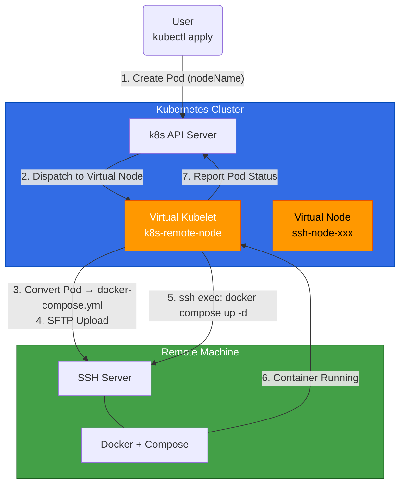

# k8s-remote-node

<p align="center">
  <strong>Zero-dependency remote node for Kubernetes. SSH in, pods run.</strong>
</p>

<p align="center">
  
  
  
</p>

---

## What is this?

**k8s-remote-node** is a [Virtual Kubelet](https://virtual-kubelet.io/) provider that turns any Linux machine with SSH and Docker into a fully functional Kubernetes node — **without installing kubelet, containerd, or any Kubernetes component on it**.

You schedule pods to the virtual node as usual. Under the hood, each pod is translated into a `docker-compose.yml`, uploaded via SFTP, and launched with `docker compose up -d` on the remote machine. From Kubernetes' perspective, everything looks exactly like a normal node.

## Architecture



> **Key insight**: The virtual kubelet acts as a bridge — it registers a virtual node in your cluster, then translates Kubernetes pod API calls into SSH commands on the remote machine. No ports need to be opened on the remote side; only outbound SSH from the cluster is required.

## Why use this?

| | Traditional Node | k8s-remote-node |
|---|---|---|
| **Agent on host** | kubelet + containerd | SSH + Docker only |
| **Resource overhead** | ~500MB+ RAM, 1+ CPU | Zero |
| **Ports to open** | 10250, 30000-32767, ... | 22 (SSH) |
| **Works behind NAT** | Need VPN / tunnel | Yes, natively |
| **Setup time** | 30+ minutes | 30 seconds |
| **Home lab friendly** | ❌ | ✅ |

## Quick Start

### 1. Deploy RBAC & virtual node

注: 推荐直接通过claude 或codex 等 进行安装（打开cli后输入: 根据文档帮我部署https://github.com/zgfh/k8s-remote-node,如果缺少信息询问我）

```bash
kubectl apply -f deploy/rbac.yaml
kubectl apply -f deploy/ssh-secret.yaml
kubectl apply -f deploy/deployment.yaml
```

### 2. Verify the node appears

```bash
kubectl get nodes
# NAME                         STATUS   ROLES   AGE
# ssh-node-192-168-1-201       Ready    agent   5s
```

### 3. Run a pod on it

```bash
kubectl apply -f deploy/test-pod.yaml
```

```bash
kubectl get pods -o wide
# NAME          READY   STATUS    NODE
# nginx-demo    1/1     Running   ssh-node-192-168-1-201
```

That's it. The nginx container is now running on your remote machine via Docker Compose, managed entirely through Kubernetes.

## How It Works

### Pod Lifecycle

```
kubectl create pod         docker compose up -d
       │                          │
       ▼                          ▼
┌──────────────┐    ┌─────────────────────────┐
│  K8s Pod     │───▶│  ConvertToCompose()     │
│  Spec        │    │  - init containers      │
└──────────────┘    │  - main containers      │
                    │  - volumes, ports, env  │
                    └───────────┬─────────────┘
                                │
                                ▼
                    ┌─────────────────────────┐
                    │  SFTP Upload            │
                    │  /opt/vk-pods/          │
                    │    <ns>/<pod>/          │
                    │      docker-compose.yml │
                    └───────────┬─────────────┘
                                │
                                ▼
                    ┌─────────────────────────┐
                    │  Remote Execution       │
                    │  cd <dir> &&            │
                    │  docker compose up -d   │
                    └───────────┬─────────────┘
                                │
                                ▼
                    ┌─────────────────────────┐
                    │  Status Sync (every 30s)│
                    │  docker compose ps      │
                    │  → K8s PodStatus        │
                    └─────────────────────────┘
```

### Supported Operations

| kubectl Command | Implementation |
|---|---|
| `kubectl create pod` | K8s Pod → docker-compose.yml → SFTP upload → `docker compose up -d` |
| `kubectl delete pod` | `docker compose down -v` + `rm -rf` |
| `kubectl logs` | `docker compose logs --tail=N` |
| `kubectl exec` | `docker compose exec -T <container> <cmd>` |
| `kubectl get pods` | `docker compose ps --format json` → PodStatus |
| Node heartbeat | `ssh echo ok` ping every few seconds |

### Resource Mapping

| Kubernetes | Docker Compose |
|---|---|
| `resources.limits.cpu` | `deploy.resources.limits.cpus` |
| `resources.limits.memory` | `deploy.resources.limits.memory` |
| `containerPort` | `ports` |
| `hostPort` | `ports[].published` |
| `env` | `environment` |
| `volumeMounts` | `volumes` (bind mounts) |
| `command` / `args` | `command` / `entrypoint` |
| `initContainers` | one-shot services with `depends_on` |

## Configuration

All settings are passed via environment variables to the deployment:

| Variable | Default | Description |
|---|---|---|
| `SSH_HOST` | *(required)* | Remote machine IP/hostname |
| `SSH_USER` | `root` | SSH login user |
| `SSH_PORT` | `22` | SSH port |
| `SSH_KEY_PATH` | `/etc/ssh-key/id_rsa` | Path to SSH private key |
| `VK_NODE_NAME` | `ssh-node-<host>` | Virtual node name in K8s |
| `WORK_DIR` | `/opt/vk-pods` | Pod compose files directory on remote |
| `LISTEN_ADDR` | `:10250` | Kubelet API listen address |
| `KUBECONFIG` | *(in-cluster if empty)* | Kubeconfig path |
| `NODE_CAPACITY_CPU` | `8` | CPU cores advertised by node |
| `NODE_CAPACITY_MEMORY` | `16Gi` | Memory advertised by node |
| `NODE_CAPACITY_PODS` | `100` | Max pods advertised by node |
| `TLS_CERT_FILE` | `/etc/vk-tls/tls.crt` | TLS cert for kubelet API |
| `TLS_KEY_FILE` | `/etc/vk-tls/tls.key` | TLS key for kubelet API |
| `LOG_LEVEL` | `info` | Log level (debug/info/warn/error) |

## Requirements

**On the remote machine:**
- Linux (amd64/arm64)
- Docker + Compose plugin (`docker compose`)
- SSH server with key-based auth

**On the Kubernetes side:**
- Kubernetes cluster (any version supported by virtual-kubelet)
- Network access to the remote machine's SSH port (22)

## Local Development

```bash
export SSH_HOST=192.168.1.201
export SSH_USER=root
export SSH_KEY_PATH=~/.ssh/id_rsa
export VK_NODE_NAME=ssh-node-dev
export WORK_DIR=/root/vk-pods
export KUBECONFIG=~/.kube/config
go run main.go
```

## License

This project is licensed under the [Apache License 2.0](LICENSE) — the same license used by Kubernetes.
